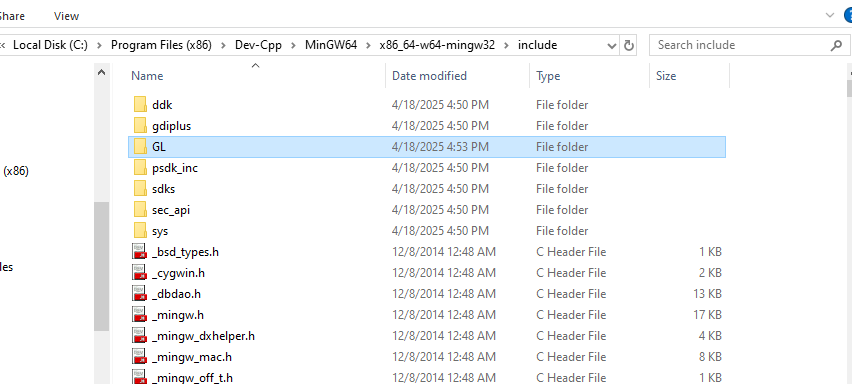

# Hướng dẫn setup OpenGL trên Dev C++

## 1. Cài đặt Dev C++
Bạn phải cài đặt bản Dev C++ mình để ở đây
[Dev C++](https://github.com/megait004/install-GLUT-on-DevC-/tree/main/DEV%20C%2B%2B)

## 2. Cài đặt OpenGL
1. Tải file [freglut-MSVC-3.0.0](https://github.com/megait004/install-GLUT-on-DevC-/tree/main/freeglut-MSVC-3.0.0-2.mp/freeglut) và giải nén.

2. Mở File Explorer và đi đến đường dẫn: `C:\Program Files (x86)\Dev-Cpp\MinGW64\x86_64-w64-mingw32`

3. Trong thư mục `freglut-MSVC-3.0.0` đã giải nén:
   - Trong thư mục `include`, copy thư mục `GL` và dán vào đường dẫn: `C:\Program Files (x86)\Dev-Cpp\MinGW64\x86_64-w64-mingw32\include` (thay thế cả thư mục `GL` hiện có)
   

   - Trong thư mục `lib\x64` của file `freeglut-MSVC-3.0.0`, copy file `freeglut.lib` và dán vào đường dẫn: `C:\Program Files (x86)\Dev-Cpp\MinGW64\x86_64-w64-mingw32\lib`
   

   - Trong thư mục `bin` của file `freeglut-MSVC-3.0.0`, copy file `freeglut.dll` và dán vào `C:\Windows\System32`

## 3. Tạo project mới
1. Mở Dev C++, chọn **New project**
   

2. Đặt tên project và chọn **Console application**
   

3. Nhấn **OK** và lưu project vào thư mục bạn muốn

4. Chuột phải vào tên project và chọn **Project Options**
   

5. Trong cửa sổ **Parameters**, ở ô **Linker**, thêm dòng sau vào: `-lopengl32 -lglu32 -lfreeglut`
   
